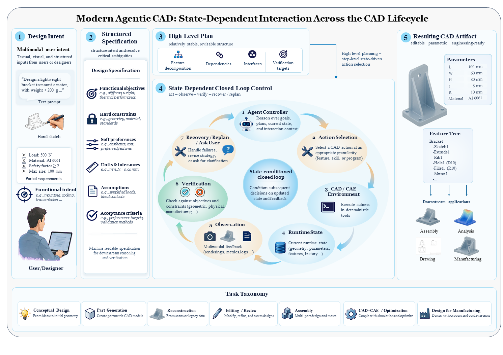
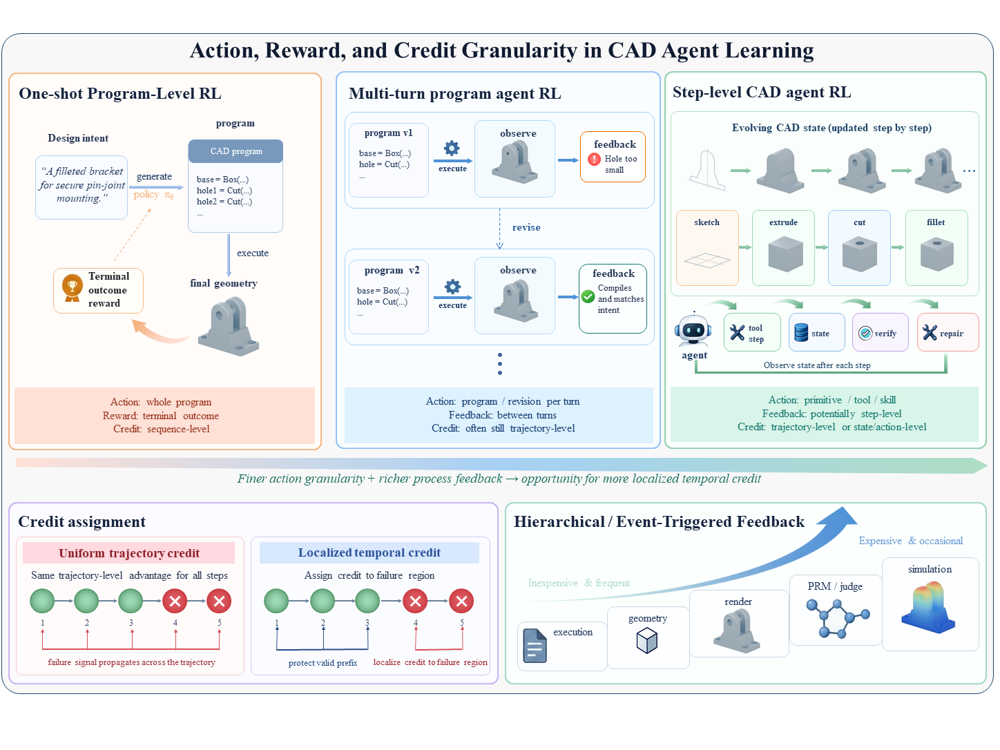
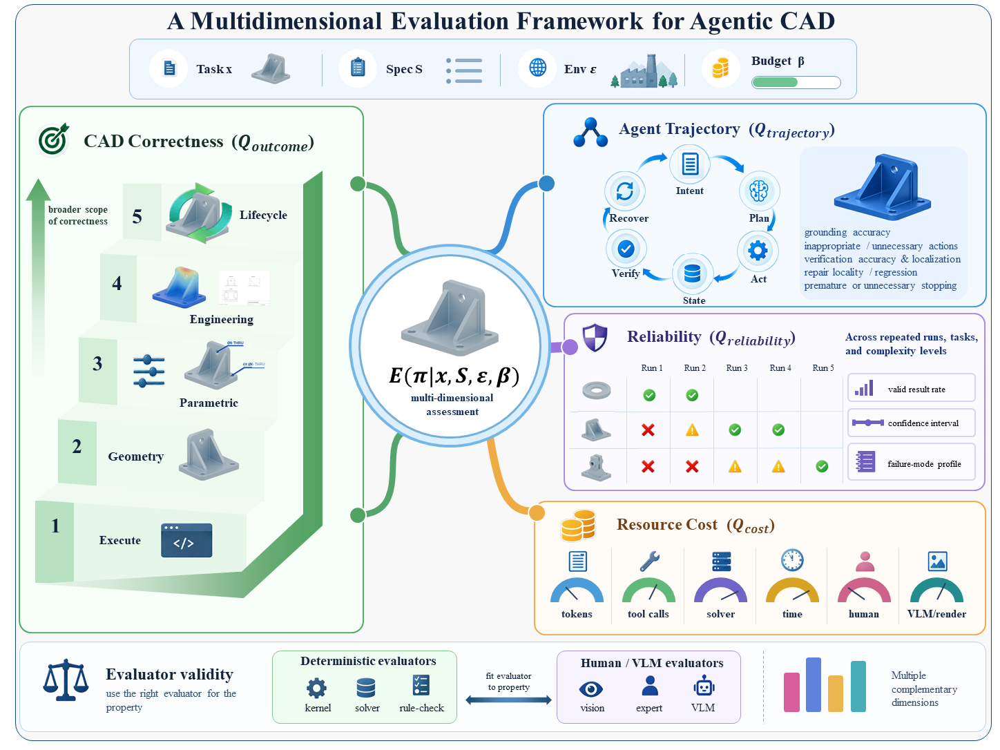

# Agentic CAD: A Survey

**A survey of Agentic CAD, CAD agents, and foundation-model-driven CAD systems.**

<p align="center">
  <a href="https://papers.ssrn.com/sol3/papers.cfm?abstract_id=7524898">
    
  </a>
  <a href="#citation">
    
  </a>
</p>

---

## Overview

Recent advances in large language models and multimodal foundation models are transforming computer-aided design (CAD) from one-shot generation toward increasingly **agentic** workflows.

This survey reviews emerging research on **Agentic CAD**, with particular emphasis on systems in which foundation models interact with CAD environments through iterative processes such as understanding design intent, planning, tool use, execution, observation, verification, and feedback.

📄 **Paper:** [Agentic CAD: A Survey — SSRN](https://papers.ssrn.com/sol3/papers.cfm?abstract_id=7524898)

---

<p align="center">
  
</p>

<p align="center">
  <em>Overview of Agentic CAD.</em>
</p>

---

## Agentic CAD Framework

<p align="center">
  
</p>

The survey organizes Agentic CAD research from complementary perspectives, including agent workflows, CAD environments, foundation models, and representative design tasks.

---

## Taxonomy

<p align="center">
  
</p>

We review representative Agentic CAD systems and organize existing research according to their workflow and application characteristics.

---

## Resources

- 📄 [Survey Paper on SSRN](https://papers.ssrn.com/sol3/papers.cfm?abstract_id=7524898)
- 🇨🇳 [Chinese Translation Resources](./pdf_中文翻译/)
- 📁 Supplementary materials and figures are available in this repository.

---

## Citation

If you find this survey or repository useful, please consider citing:

```bibtex
@article{zhang2026agenticcad,
  title   = {Agentic CAD: A Survey},
  author  = {Zhang, Xuecheng and He, Fazhi and Zhou, Xiaolu and Deng, Enxi
             and Qu, Guanlin and Wang, Haokun and Lin, Qingyuan
             and Fan, Rubin and Lei, Yixiang and Wan, Ruibo},
  year    = {2026},
  journal = {SSRN}
}
